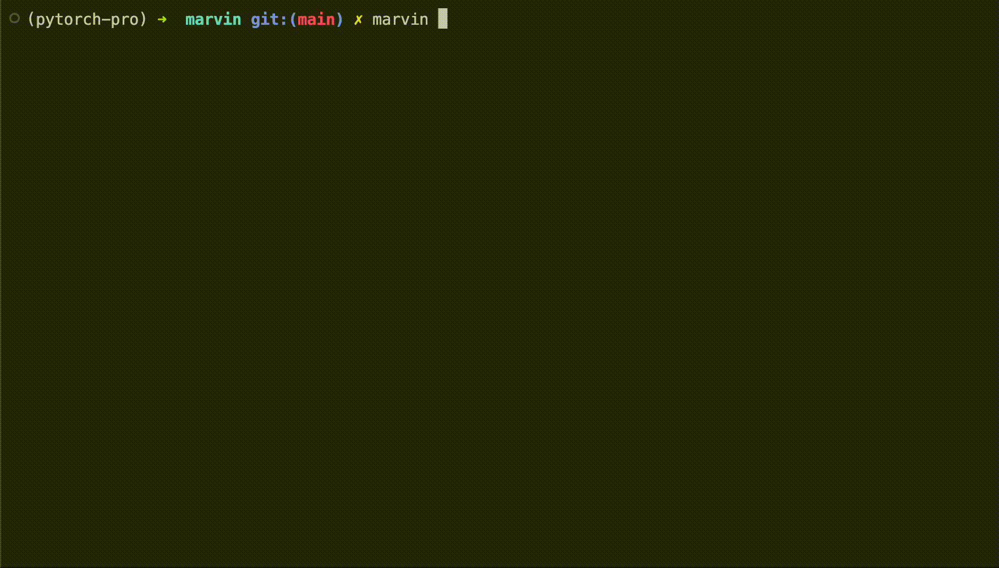

<p align="center">
  
</p>

# <u>marvin</u>: a <span style="color:aqua">GPT powered cli tool</span> that helps you remember bash commands

`Marvin` is an AI robot first mentioned in the book [`The Hitchhiker's Guide to the Galaxy- Doughlas Adams`](https://en.wikipedia.org/wiki/The_Hitchhiker%27s_Guide_to_the_Galaxy). It's a great sci-fi series, if you haven't already read it, this is your cue. 
Since then marvin has been reprogrammed to convert english descriptions into bash commands and other cli based tasks. The user can just ask him anything regarding that right in the CLI. But son't bug him too much ;)



## How to use?
- Get your own `OpenAI API key` (or help me get more OpenAI credits by `buying me a book` 👀 [here](https://www.buymeacoffee.com/kaus.mos))
```
$ git clone https://github.com/kaustubh-s1/marvin.git 
$ cd marvin

Create a virtual environment-
$ python3 -m virtualenv venv
$ source venv/bin/activate

Install dependencies-
$ pip install -r requirements.txt

Getting started-
$ alias marvin="python -m marvin"
$ marvin --add-openai-key <copy/paste your key here>
```

## Usage

Ask for terminal commands

`$ marvin <natural language command description>`

### Examples:

```
$ marvin how are you
$ echo "I'm doing great!"
```

```
$ marvin how to list all the files in directory
$ ls -a
```

```
$ marvin move file into other directory  
$ mv [OPTIONS] FILE TARGET_DIRECTORY
```

```
$ marvin print hello bash 
$ echo "Hello bash"
```

```
$ marvin how to find the sum of two numbers in bash
$ echo $(($NUMBER1 + $NUMBER2))
```

You can even do a basic google search (`curl`) kinda thing with it-
```
$ marvin make a google search about Haruki Murakami 
$ curl -s https://www.google.com/search?q=Haruki+Murakami
```
